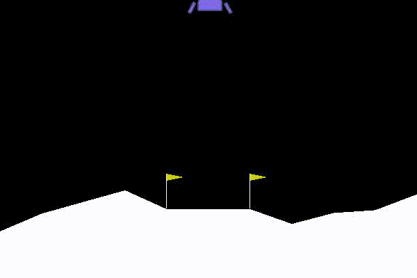

# Parallel PPO-PyTorch

A parallel agent training version of Proximal Policy Optimization with clipped objective.

## Usage

- To test a pre-trained network : run `test.py`
- To train a new network : run `parallel_PPO.py`
- All the hyperparameters are in the file, main function

## Results

|              CartPole              |             LunarLander             |
| :--------------------------------: | :---------------------------------: |
|  |  |

## Dependencies

Trained and tested on:

```
Python 3.6
PyTorch 1.3
NumPy 1.15.3
gym 0.10.8
Pillow 5.3.0
```

## TODO

- [ ] implement Conv net based training

## References

- PPO [paper](https://arxiv.org/abs/1707.06347)
- [PPO-PyTorch github](https://github.com/nikhilbarhate99/PPO-PyTorch)
